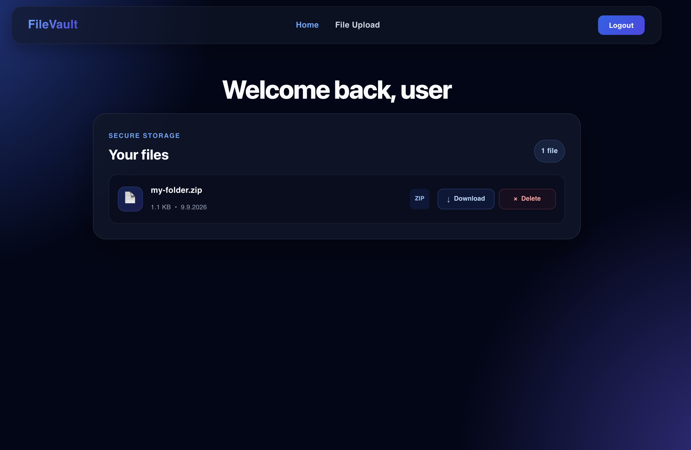
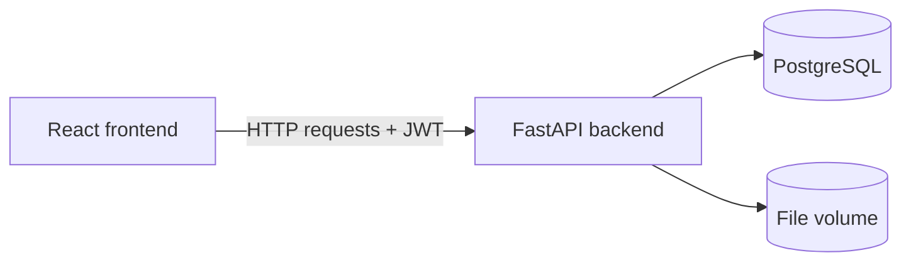

# FileVault

FileVault is a small self-hosted file management application that allows users to create an account and manage their own files through a web interface.

Users can upload, view, download, and delete their files. JWT-based authentication and ownership checks ensure that every user can only access their own files.

This project was created as a side project to refresh my knowledge of full-stack development, Docker, authentication, databases, API design, and automated checks. I was already familiar with TypeScript, React, Docker, and JWT authentication, while Python and FastAPI were new to me.

AI tools were used for guidance, debugging, explanations, and code reviews. The main purpose of FileVault was learning, experimenting, and gaining practical experience rather than building a production-ready storage platform.

## Preview

## Project Status

FileVault is a completed learning MVP. It demonstrates the complete flow from a React interface through an authenticated FastAPI backend to PostgreSQL and persistent file storage.

It is not intended to be used as a production-ready or internet-facing storage service without additional hardening such as HTTPS, rate limiting, backups, monitoring, stricter deployment configuration, and additional security controls.

## Features

* User registration and login
* Secure password hashing
* JWT-based authentication
* Protected API endpoints
* File uploads with configurable size limits
* Listing stored files
* Downloading and deleting files
* Ownership checks for every file operation
* Persistent PostgreSQL and file storage
* Automated backend tests
* Automated frontend lint and build checks

## Architecture

The React frontend handles the user interface and communicates with the backend through a typed API layer.

FastAPI receives the requests, validates authentication and input data, and delegates business logic to service functions. PostgreSQL stores users and file metadata, while the actual file contents are stored separately in a persistent Docker volume.

The backend is organized into:

* API routes for handling HTTP requests and responses
* Dependencies for authentication and database sessions
* Services for business logic
* SQLAlchemy models for database entities
* Pydantic schemas for API validation
* Alembic migrations for database changes

The frontend follows an MVVM-inspired structure:

* Models handle API communication and response types
* ViewModels manage state and application logic
* Views render the user interface

## Tech Stack

* **Frontend:** React, TypeScript, Vite
* **Backend:** Python, FastAPI, SQLAlchemy
* **Database:** PostgreSQL
* **Authentication:** JWT, pwdlib with Argon2
* **Migrations:** Alembic
* **Infrastructure:** Docker, Docker Compose, Nginx
* **Testing:** Pytest
* **Automation:** GitHub Actions, Oxlint, TypeScript build checks

## Data Storage

Docker Compose creates two persistent volumes:

* `postgres_data` stores the PostgreSQL database
* `file_data` stores uploaded file contents

The database contains file metadata such as the original filename, content type, size, owner, and storage identifier. The actual file data is stored separately in the file volume.

Stopping or rebuilding the containers does not delete these volumes.
